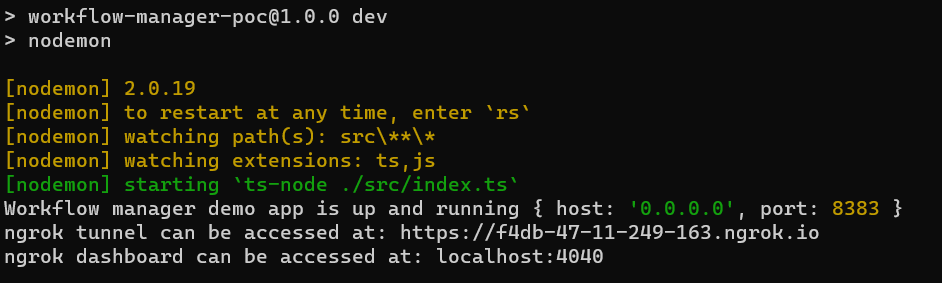

# Workflow Manager Using N8N

Embarking on a proof of concept journey to showcase the potential of tools like N8N, I aim to construct an enterprise-grade workflow manager tailored for internal services or processes. Let's innovate and elevate our operational efficiency together!

## Features ##
- Leveraging N8N, Workfrom offers an intuitive GUI to transform your workflow into an automated, actionable node.
- Utilizing Docker Compose to initialize setup and run Postgres, pgAdmin, and N8N.

## Technology Stack ##

- [TypeScript](http://www.typescriptlang.org/): statically typed superset of latest ECMAScript features that transpiles to selected JavaScript version
- [NodeJS](https://nodejs.org/en/): server-side JavaScript runtime based on Google Chrome's V8 engine
- [ngrok](https://ngrok.com/): ngrok is a globally distributed reverse proxy fronting your web services running in any cloud or private network, or your machine.
- [Express](https://expressjs.com/): Express is a minimal and flexible Node.js web application framework that provides a robust set of features for web and mobile applications
- [Postgres](https://www.postgresql.org/): PostgreSQL is a powerful, open source object-relational database system
- [n8n](https://n8n.io/): n8n is a free and source-available workflow automation tool
- [Docker](https://www.docker.com/): Docker is a set of platform as a service products that use OS-level virtualization to deliver software in packages called containers

## Installation ##

All development tooling is available cross-platform.

- NodeJS
- VS Code
- Docker
- Git

### Hardware ###

Workflow manager development requires running the Code Editor, the express server, n8n server, docker & database which demands significant processing resources:

| Component | Minimum                | Recommended               |
|-----------|------------------------|---------------------------|
| Processor | >=Core i5 2-core @2GHz | >=Core i7 4-core @2.5 GHz |
| RAM       | >=8GB                  | >=16GB                    |
| Disk      | >=128GB SSD            | >=128GB SSD               |


### Clone Project ###
```
git clone https://github.com/cah-sourabh-singh/workflow-manager-poc.git
```

### Update environment variables ###
Create a .env file and update following variables accordingly:
```
POSTGRES_USER=
POSTGRES_PASSWORD=
POSTGRES_DB=n8n

POSTGRES_NON_ROOT_USER=
POSTGRES_NON_ROOT_PASSWORD=

N8N_BASIC_AUTH_USER=
N8N_BASIC_AUTH_PASSWORD=
```
### Note: In a real world you shouldn't commit your application's secrets to any of the source code management tools, it should always be kept and fetched from Vault or Secrets manager. 

## Development Scripts ##

The following NPM scripts are defined in `package.json` & may be executed with `npm run <scriptname>` at the commandline:

- **`dev`**: Run the server in development mode

### Install Dependencies ###

1. Install ngrok globally: 
`> npm i -g ngrok`
2. Login to ngrok (https://ngrok.com/) and copy the token, once done run the following command:
`> ngrok config add-authtoken <TOKEN>`
3. In a command prompt:
`> docker-compose up -d`
4. Install packages:
`> cd <project_folder> && npm i`
5. Run express server:
`> npm run dev`
6. Import the workflow from `workflows` directory to n8n dashboard
7. Update the base ngrok url with your tunnel url from the terminal

### Use Links Below to Access The Apps ###
- n8n - http://localhost:5678/
- PgAdmin - http://localhost:5050/
- Express App - http://localhost:8383
  - [GET] http://localhost:8383/api/healthcheck
  - ngrok url will be displayed on the terminal and will change on server restart
  


## Contact ##
[sourabh8003@gmail.com](mailto:sourabh8003@gmail.com)
